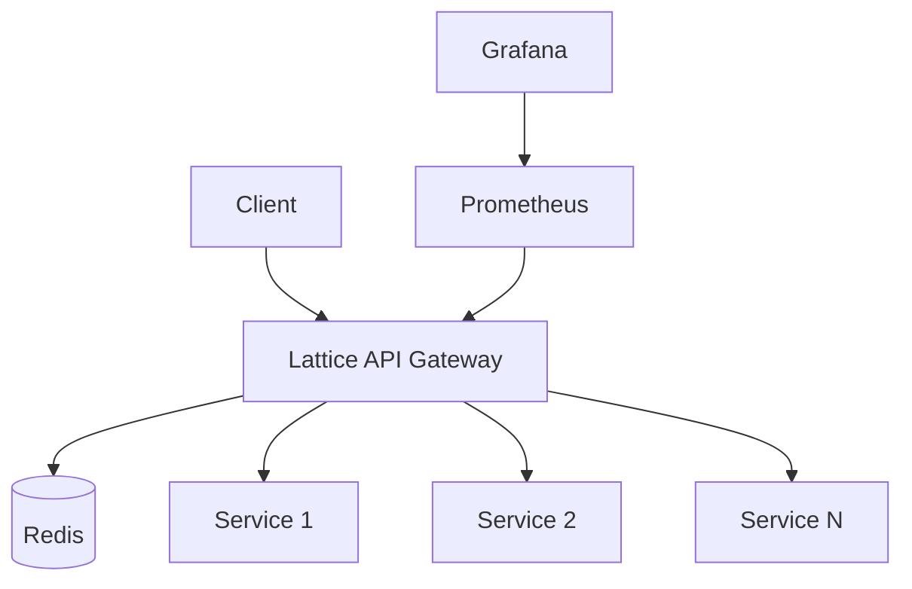

# Lattice

A high-performance API Gateway written in Go that provides authentication, caching, rate limiting, and dynamic configuration management.

## Features

**Core Features**

-   Dynamic route configuration via Redis
-   JWT and API key authentication
-   Response caching with Redis
-   Distributed rate limiting
-   Reverse proxy to upstream services
-   Automatic retry and circuit breaking
-   Load balancing

**Observability**

-   Prometheus metrics
-   Grafana dashboards
-   Structured logging (zap)
-   Distributed tracing
-   Health checks

**Security**

-   JWT validation
-   API key management
-   Role-based access control
-   TLS termination
-   Request validation

## Architecture

